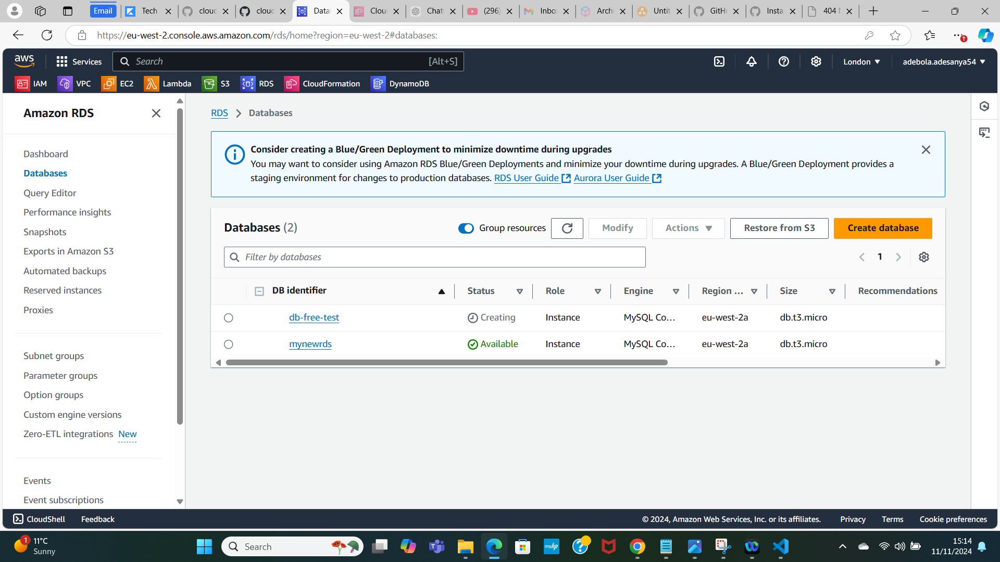
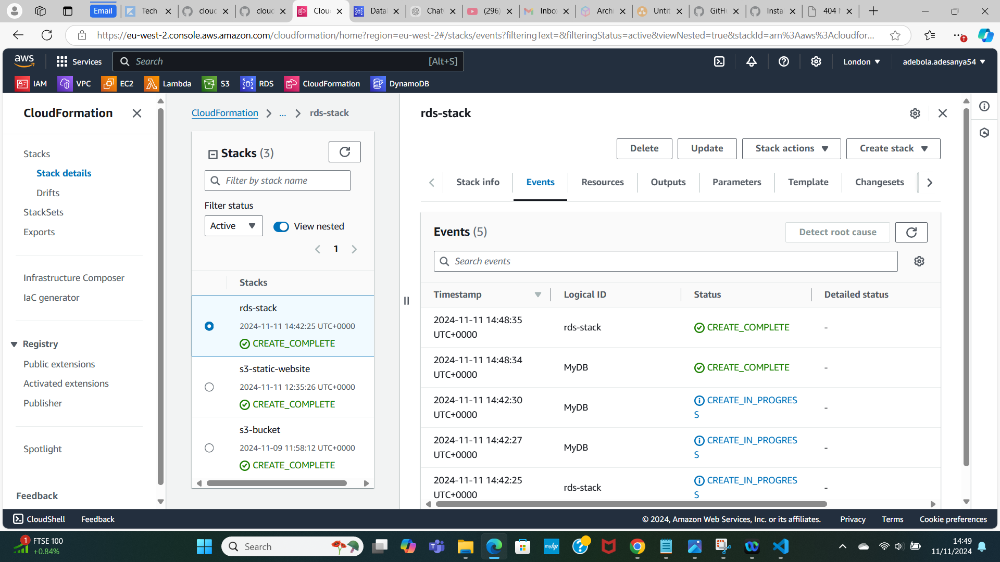
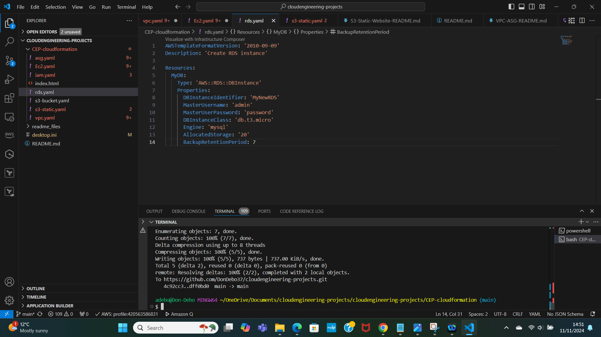
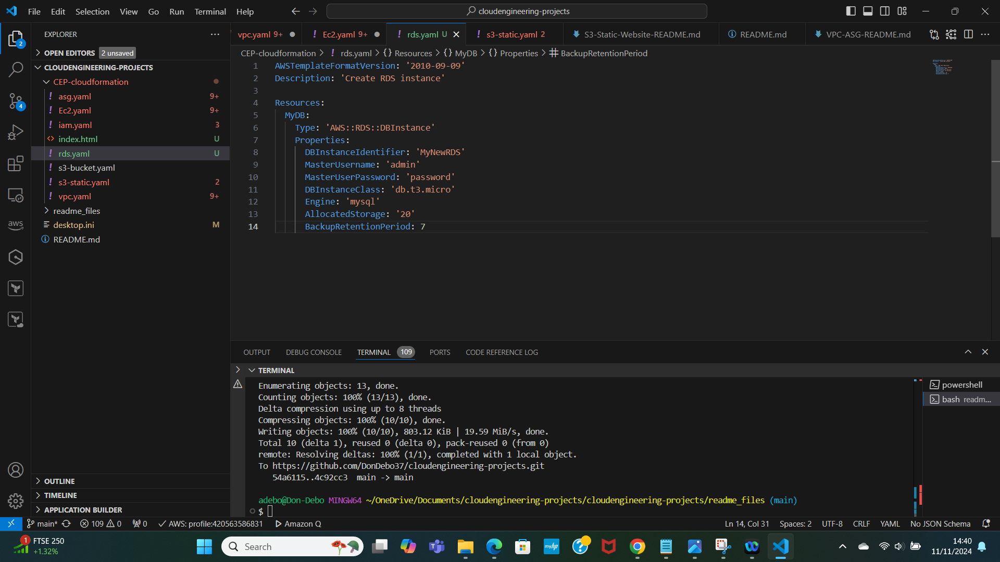

# RDS Instance Creation with CloudFormation

This documentation outlines the process of creating an Amazon Relational Database instance using AWS CloudFormation.

## CloudFormation Template

My CloudFormation template creates a MySQL RDS instance with the following specifications:

```yaml
AWSTemplateFormatVersion: '2010-09-09'
Description: 'Create RDS instance'

Resources:
  MyDB:
    Type: 'AWS::RDS::DBInstance'
    Properties:
      DBInstanceIdentifier: 'MyNewRDS'
      MasterUsername: 'admin'
      MasterUserPassword: 'password'
      DBInstanceClass: 'db.t3.micro'
      Engine: 'mysql'
      AllocatedStorage: '20'
      BackupRetentionPeriod: 7
```

### Template Breakdown:

- **DBInstanceIdentifier**: The name of the RDS instance (MyNewRDS)
- **MasterUsername**: The admin username for the database (admin)
- **MasterUserPassword**: The password for the admin user (password)
- **DBInstanceClass**: The instance type (db.t3.micro, which is eligible for free tier)
- **Engine**: The database engine (MySQL)
- **AllocatedStorage**: The allocated storage in GB (20)
- **BackupRetentionPeriod**: Number of days to retain automated backups (7)

**Note**: In a production environment, you should never hardcode sensitive information like passwords in your template. Use AWS Secrets Manager or parameter store instead.

## Deployment Process

### 1. CloudFormation Stack Creation



This screenshot shows the AWS console where I successfully created the 2 databases with Console and Iac CloudFormation.

### 2. Stack Deployment



Here we can see the stack  has been successfully deployed, with details about the resources being created.

### 3. RDS Instance Created with CloudFormation



This is my VS Code interface showing the successfully created RDS instance using our CloudFormation template.

## Version Control

### Pushing to Git



I use Git for version control. This screenshot demonstrates the process of pushing my CloudFormation template to my Git repository.

## Best Practices

1. **Security**: Always use strong, unique passwords and consider using AWS Secrets Manager for sensitive information.
2. **Monitoring**: Set up CloudWatch alarms to monitor your RDS instance.
3. **Backup**: While I've set a 7-day backup retention period, consider your specific needs and adjust accordingly.
4. **Scaling**: The `db.t3.micro` instance is good for development but may need to be scaled for production use.

## Next Steps

1. Connect to your new RDS instance using a MySQL client.
2. Set up appropriate security groups and network access controls.
3. Implement a strategy for database updates and migrations.